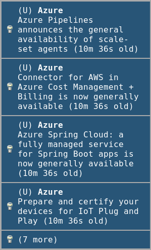

# azblogfilter - Azure Blog Filter


## Description

Fetch and filter Azure blog posts (announcements and updates) based off of interests.

Why? Because I am interested in getting Azure news, but the cloud is a big (and noisy) place. I only want the news I care about most.

## Installation

You can get the binary from the [latest release](https://github.com/trstringer/azblogfilter/releases).

Otherwise, if you want to run from trunk you could git clone this repo and `make install`.

If you are a systemd user, you can install a systemd unit and timer to routinely check for blog updates by running `make install-systemd`.

## Usage

azblogfilter filters blog posts either by a cached value (good for the usage of "what are the new blog posts that have been published since I last checked?" This is the mechanism used in the systemd service). Or it can use `--since` to go back in the past for blog posts without using cache. The `--since` parameter takes a systemd time span (`man 7 systemd.time`). E.g. to get all blog posts in the past 3 days you could specify `--since -3d`.

```
Filter posts by keywords and categories.
You can also specify the time filter by using
a built-in caching mechanism or by specifying
the time manually

Examples:
	Get all blog posts in the past 7 days.

	$ azblogfilter --since -7d

	Get all blog posts since last run that have
	Kubernetes or Linux in the title.

	$ azblogfilter --cache --keywords "kubernetes,linux"

	Get all blog posts that have Linux in the title or
	have the DevOps category.

	$ azblogfilter --cache --keywords linux --categories devops

Usage:
  azblogfilter [flags]

Flags:
      --cache                   use cached value
      --cache-location string   location for cache (default "~/.azblogfilter")
  -c, --categories string       categories filter (case insensitive)
      --config string           config file (default is $HOME/.azblogfilter.yaml)
  -h, --help                    help for azblogfilter
  -k, --keywords string         keywords filter (case insensitive)
  -o, --output string           output format, json or csv (default "json")
  -s, --since string            filter post with systemd time (man 7 systemd.time)
  -v, --version                 get version
```

### Config

azblogfilter uses a config-based filtering mechanism. The config file (optional) is located at `~/.azblogfilter.yaml`. It should be a list of `keywords` and `categories`.

**Keywords** filter the Azure blog entries by title. **Categories** filter the blog entries by category/tag. Here is a sample config:

```yaml
keywords:
  - linux
  - kubernetes
  - postgres
  - github
  - devops
  - repo
  - pipeline
  - container
  - storage
  - blob
  - virtual machine
  - aks

categories:
  - devops
  - developer
  - announcements
```

## Notifications

I use `dunstify` for notifications. If you run `make install-notify` it will place this script in a path location. It is used, for me, from a systemd unit to notify if there is a new blog entry.



## Development

#### Create a release

```
$ make release
$ git push --tags origin master
```
